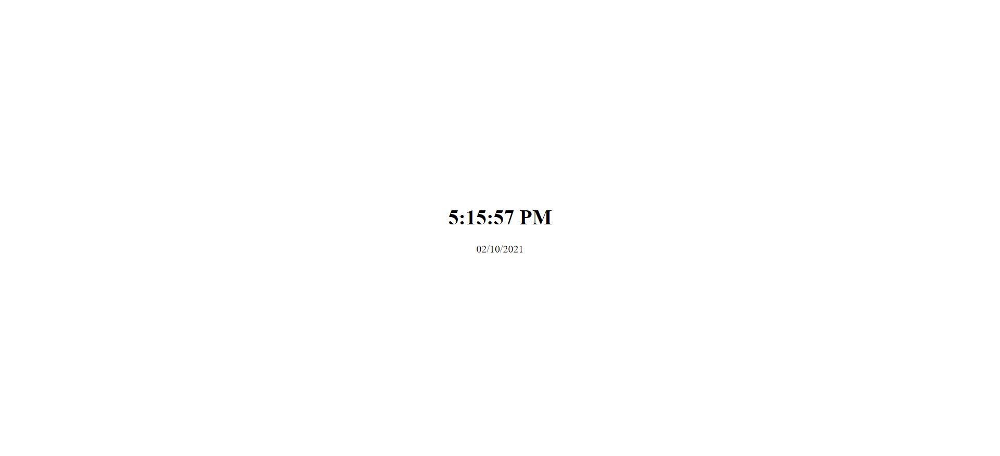

# Digital Clock

A simple digital clock which displays current time followed by date.

1. Time is displayed in US English format (uses 12-hour time with AM/PM)
2. Date follows British English format (uses day-month-year order)

## Live Demo

Codepen link: [Digital Clock](https://codepen.io/vaishak10/pen/XWgQYxm)

## Snapshot

## Resources

-   [Date.prototype.toLocaleDateString()](https://developer.mozilla.org/en-US/docs/Web/JavaScript/Reference/Global_Objects/Date/toLocaleDateString)
-   [Date.prototype.toLocaleTimeString()](https://developer.mozilla.org/en-US/docs/Web/JavaScript/Reference/Global_Objects/Date/toLocaleTimeString)
-   [setInterval](https://developer.mozilla.org/en-US/docs/Web/API/setInterval)
